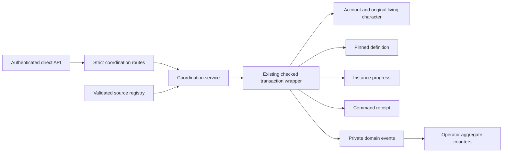

# Coordination architecture

## Current implementation

`src/coordination/graph.js` validates and deep-freezes definitions and mints a branded registry. It reuses `canonicalBytes` and UTF-8 canonical ordering from `src/content/canonical.js`. It hashes normalized definition data under the versioned `omerta:coordination:graph:v1` or `v2` domain; object, node and logical-child order do not create distinct identities. Schema 2 adds typed hidden-task discovery claims and independent evidence. Schema 1 and The Dead Letter's original hash remain unchanged. A graph's version remains semantic identity, so changing text or rules under the same ID/version is refused after persistence.

`src/coordination/pilot.js` defines **The Dead Letter** and schema-2 **The Split Ledger**. The knowledge flag controls new access to the latter. Registry selection is code-controlled, not a player upload or automatic content activation. A running process has one selected version per graph ID. Enabling the feature is an independent deployment choice.

`src/coordination/runtime.js` owns the checked transaction and command-receipt boundary. It resolves current account/character state inside `withPhase2Transaction`, locks the living character and account in the existing order, locks an owned instance when changing it, verifies the pinned definition, rechecks the revision and issued action, and writes state, events and a completed receipt before COMMIT. Knowledge-sensitive reads use the same short checked transaction, without domain writes, to keep live permission locks through projection. Only aggregate metrics use the ordinary `withPhase2Read` snapshot.

`src/coordination/knowledge.js` shares that client and transaction. It authenticates every claim against its pinned definition, original discovery event and owner tuple. Grants change access; links record player assertions; archives reference the original claim. A branded context locks the caller's `crew_members` row, then `gang_members` row, `FOR SHARE` after the actor lock. It never locks `crews`, `gangs` or another actor afterward. Existing Crew routes lock Crew before their actor, and Family removal locks Family after its actor; holding only the membership leaves avoids reversing those existing orders. Relevant claim rows serialize projections and ACL changes; a fresh grant read follows the claim lock. See the [membership design record](evidence/phase1-membership-design.txt) and [Phase 01 review](PHASE_01_REVIEW.md) for executable interleavings and limits.

The service deliberately avoids `G.withCharacter` and `readCharacter`, because they can accrue/persist unrelated gameplay state. It imports `GameError` and the existing `levelOf` formula, never a replacement economic formula. It does not nest transactions or invoke item/domain effects. The shared wrapper's serialization and inverse writes are a test-driver fallback; real PostgreSQL correctness uses its transactions and row locks.

`src/routes/coordination.js` uses the existing auth and rate-limit perimeter. Raw input is checked before Fastify can strip unknown fields or coerce types. `src/agentgateway.js` publishes explicit machine contracts. Operator-only metrics are excluded from player OpenAPI. No new dependency or service process is required.

## Ownership and visibility

A run's owner tuple never changes. Reading/cancelling historical state is an account right; executing its graph is restricted to the original living character. An heir does not inherit execution. Removing the feature or a graph from the active registry does not delete pinned history. Cancellation remains a value-neutral terminal transition.

All Phase 00 runs are private. `public` on a node means visible within its owner's run, not publicly readable by anyone. Hidden nodes appear only after a permitted discovery; discover actions carry opaque issued IDs and a generic label. No graph definition, raw condition, hidden dependency count, owner ID or event payload is serialized to players. The content hash identifies a version; it is not a secrecy mechanism or bearer authority.

## Future integration boundaries

Knowledge is separate from `content_instance_facts`, authored story flags and item provenance. Future organization phases add delegated authority and trust while continuing to derive current Crew/Family membership; relationship graphs cannot grant membership. Operation phases extend the coordination profile for private roles and deadline handling while preserving existing `src/operations.js` as the Phase 1 item/escrow authority. Economic phases call reviewed domain adapters and must compose transaction ownership explicitly; passing a client from one branded wrapper to another is not allowed by default.

Durable event consumers are future work: add closed event schemas, per-consumer receipts, retry/dead-letter policy and private projections together. The in-process gameplay EventEmitter is neither a durable queue nor a safe automatic destination for private coordination payloads. AI-generated candidates stay outside runtime authority and go through deterministic compile/validation/activation.

See [ADR 001](adr/ADR_001_COORDINATION_GRAPH.md), [ADR 002](adr/ADR_002_EVENT_ARCHITECTURE.md), [ADR 003](adr/ADR_003_KNOWLEDGE_IMMUTABILITY.md), [ADR 004](adr/ADR_004_AUTHORIZATION.md) and [ADR 005](adr/ADR_005_AI_CONTENT_BOUNDARY.md).
