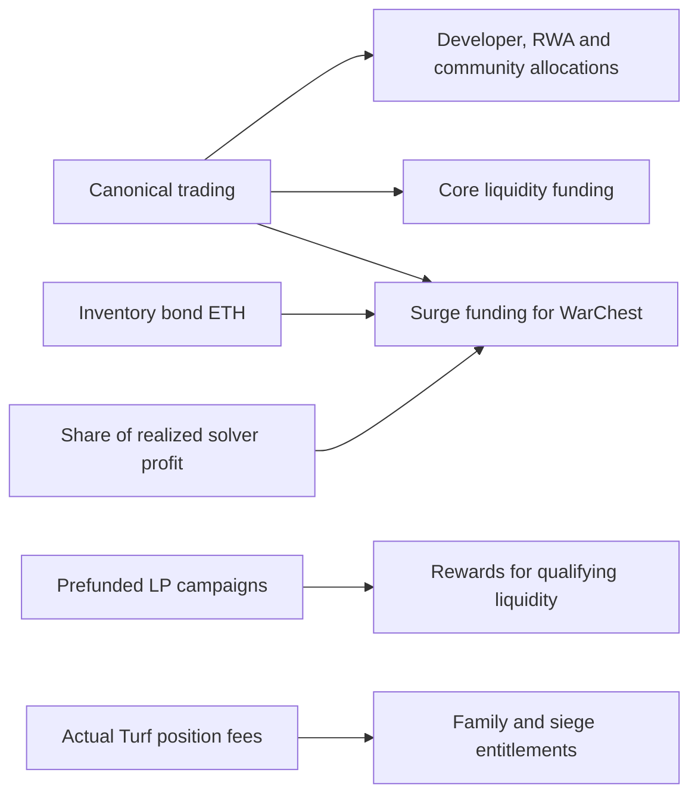

**Omertà and OMR: the plain-language investor explanation**

Updated September 25, 2026, America/New_York. This guide describes Omertà’s current game and market model: funded market support, inventory bonds, liquidity rewards, territorial fee rights and arbitrage-funded reserves. The companion [technical explanation](02-technical-detail.md) provides the contract mechanics, formulas, authority limits and source references.

**1. What someone is actually buying**

Omertà is a multiplayer mafia strategy RPG. You develop a character, earn game money, specialize, build businesses, cooperate with other players and compete over money, territory and influence. Characters can die permanently, while selected account assets and legacy survive. Humans, software agents and NPCs can participate.

OMR is the project's blockchain token and the denomination of a separate in-game premium balance. A buyer is speculating that enough people will want to acquire, use or hold OMR for the game and its market economy to support a higher future market price. The market also gives liquidity providers, competing Families and arbitrage operators distinct ways to participate; those participants' rewards are different from the rights of someone simply holding OMR.

OMR does not, by itself, give its holder ownership of the company, a guaranteed dividend, a claim on all treasury assets, a fixed-dollar redemption right or control of the project's administrator wallet. Buying OMR, playing well and receiving a particular gameplay reward are three different economic activities.

**2. The current market and what the source establishes**

The market’s ten implementation contracts are written. Their functions are explained below as parts of the current model. Source code establishes the rules; deployment, funding, live campaign terms and activation require corresponding release and on-chain evidence. This guide does not establish a current token price, trading volume or realized investor yield.

The current market combines trading fees, market observations, segregated liquidity budgets, sales of existing OMR inventory, rewards for useful liquidity, Family fee rights and solver-funded arbitrage. The [market design](../../omerta-contracts/docs/market/DESIGN.md) and [technical explanation](02-technical-detail.md) map these mechanisms to their contracts.

**3. The three balances to keep separate**

| Balance | What it means |
|---|---|
| Game cash | Spending money inside the RPG. The dollar sign does not make it US dollars. It cannot be freely converted back into OMR. |
| In-game OMR | An account balance used for selected purchases, status, stakes and rewards. It is subject to game rules, administrator-controlled services and withdrawal conditions. |
| Wallet OMR | Actual ERC-20 tokens on Robinhood Chain. Game combat cannot simply seize tokens from an unrelated external wallet. |

Respect, levels, prestige and reputation are progression, not money. NFTs are distinct assets, with different rights depending on whether they represent gear, a vehicle, a street deed or a dynasty portrait.

There is a one-way window for spending OMR to receive game cash from a funded till. That does not create the reverse conversion. Some missions award finite in-game OMR, and funded pools can distribute OMR rewards; this is different from unlimited token creation by farming cash.

**4. Why a player might want OMR**

OMR purchases or supports a range of game features: equipment and upgrades, changing a career, selected intelligence and protection services, estates and prestige assets, subscriptions, auctions, selected store/respawn alternatives and access stakes.

Examples from the current rules:

- **Made status:** 120 OMR for 30 days, including a one-rung shortcut on the holding ladder.
- **Holding ladder:** 60, 180, 450 and 900 effective staked OMR unlock increasing capacity and selected bonuses.
- **Commitment:** a 7-, 30- or 90-day in-game lock counts as 1.25, 1.5 or 2 times the stake for that ladder. It does not create additional tokens.
- **Career switch:** 150 OMR, with a seven-day cooldown.
- **High-stakes room:** requires 300 staked OMR plus level 30 or tier-2 Madame standing, even though its wagers themselves use game cash.

This creates both spending demand and a reason to keep a balance. Some purchases provide real mechanical advantages; presenting all monetization as purely cosmetic would be inaccurate. The free career mission ladder currently awards 1,320 OMR across nine once-per-account awards, so certain holding milestones are also reachable through progression. Those are game credits, not automatic, immediately withdrawable blockchain payouts.

**5. Why the game could be engaging**

There are six career identities: Gun, Ledger, Kitchen, Wheel, Shadow and Ring. They emphasize combat, business, production, transport, intelligence and competitive fighting, with meaningful tradeoffs.

The wider game combines crimes, car theft, trading, laboratories, businesses, heists, convoys, piracy, racing, boxing, cash casinos, lending, prison, investigations, blackmail, NPC relationships, crafting and authored mysteries. Small Crews and larger Families create cooperation; wars, turf and Commission politics create rivalry. Twenty-eight-day seasons refresh selected rankings and progression while preserving more than a full character-death wipe would.

The commercial attraction is that rivals, alliances, scarce opportunities and personal history can give players reasons to return and spend. The risk is that loss, complexity, time demands or wealthy-player advantages may push them away. These are product hypotheses until player retention and payment data demonstrate them.

**6. The cost of bringing value into the game**

OMR kept inside the game can be at risk. An eligible lethal player attack can take 50% of liquid/unbonding OMR and 20% of staked OMR. Death duty then takes 25% of remaining liquid/unbonding OMR. A lock does not protect stake from these rules.

For example, a character with 1,000 liquid and 1,000 staked OMR could lose 700 to the killer and another 125 to death duty, leaving 1,175 for the account. This example assumes ordinary applicable loot settings and no intervening protection or modifiers.

Separately, extracting in-game OMR is designed to charge a 2% toll plus a fresh-balance surcharge that starts at 50% and declines to zero over 48 hours. These charges are additive. Newly earned OMR is considered first. A later sale through the intended canonical pool adds its sell charge, ordinary trading fees, price impact and gas.

Buying and holding external wallet OMR does not automatically incur the game withdrawal surcharge. That surcharge applies when leaving game custody.

**7. The current market economy**

The market connects trading, treasury inventory, liquidity provision and Family competition. Its ten contracts implement the following mechanisms. Each mechanism has its own funding requirements, beneficiaries and limits.

| Mechanism | Plain-language explanation | Why an investor might care |
|---|---|---|
| Trading fees | Canonical sells pay a 9% base fee plus up to 1% extra under sell pressure. Normal buys after the opening window have no hook tax; ordinary LP fees still apply. | Trading can fund liquidity and reserves. Fees also make exiting more expensive and may push activity to other venues. |
| Funded market support | Separate pools of ETH and OMR provide liquidity in specified price ranges. ETH-funded ranges acquire OMR during weakness; OMR-funded ranges sell into strength. | Can improve trading depth and make treasury deployment more disciplined, within available funds. It does not guarantee a minimum token price. |
| Inventory bonds | Buyers pay ETH for discounted OMR the contract already owns, released over time. | This bond mechanism raises ETH without minting new tokens at purchase; it still puts existing inventory into buyers' hands. |
| LP commitment rewards | People lock eligible liquidity-position NFTs and can earn prefunded ETH for qualifying liquidity over time. | Creates a reason to supply useful liquidity. Rewards require participation and funding; ordinary OMR holders do not automatically receive them. |
| Turf and sieges | Families compete over rights to actual fees earned by designated liquidity positions. | Gives territorial competition a direct connection to funded market revenue. It grants fee rights, not ownership of LP principal. |
| Arbitrage | Traders use their own capital to exploit price differences, with a configured portion of realized profit supporting reserves. | Can help align venue prices and replenish reserves when profitable opportunities exist. |

**Where the sell fee goes.** The 9% base is 2% developer, 1.6% RWA allocation, 2.4% community and 3% protocol liquidity, measured against the applicable trade base. The additional 0–1% surge goes to stability funding. A destination labeled RWA is an allocation; it does not itself prove that stocks have been purchased or dividends delivered. Exact-input and exact-output swaps can collect fees in different assets.

**How market support works.** The controller separates its funds into seven compartments: Core, Lower Cushion, Garrison, Upper Cushion, Desk, WarChest and Turf. Core provides ordinary two-sided liquidity. Lower Cushion and Garrison hold capital for buying OMR in weaker markets; Upper Cushion and Desk provide OMR for sale in stronger markets. WarChest holds recovery capital, and Turf supports the seasonal fee positions.

The controller uses observed price, volatility, liquidity and sell pressure to decide when deployment is allowed. It checks fresh observations, cooldowns and action, episode and lifetime budgets. Adding funds does not automatically reset its spending authority. A position can reverse its asset composition if price reverses before it is finalized. Governance can recover capital under the contract's rules, so these compartments are conditional market support rather than an irrevocable redemption floor.

**How inventory bonds work.** OmertaInventoryBondV2 sells prefunded OMR and reserves each buyer's full promised amount immediately. Its discount cannot exceed 10%; vesting is configured between one and 365 days. Those are code bounds, not an announced production offer. Claims remain available under the contract's rules even if new purchases pause. This removes minting from that specific sale mechanism, but the underlying OMR token still has an owner-controlled mint role.

The 3% protocol-liquidity allocation is intended to fund Core. Surge receipts, inventory-bond proceeds and the arbitrage reserve share are intended to fund WarChest through fixed-destination adapters. A transfer adds actual capital; it does not reset the controller’s spending limits. These fees apply to the canonical pool. Independent venues can have different charges.

**Who earns liquidity rewards.** An LP supplies both market exposure and an actual eligible position NFT. The commitment vault rewards measured useful depth and elapsed time, bounded by each position's limit and the campaign's available ETH. A large advertised rate is not the product: the product is a finite campaign paying for qualifying liquidity. LPs retain price/inventory risk, and checkpoint timing can matter when the reward budget is scarce.

**What Families fight over.** A syndicate can contain up to four Families with agreed shares. Seasons can define up to 64 Turf positions. Fees accrued before an ownership change remain owed to their historical beneficiaries. During a siege, actual incoming fees enter escrow; the outcome determines the permitted split and future ownership. The game still adjudicates combat, with a typed contract adapter authenticating the result. These fee rights settle through the market contracts while combat is adjudicated by the game server.

**How arbitrage contributes.** A solver funds an atomic ETH-to-OMR-to-ETH trade across eligible venues. A successful trade must meet a positive profit minimum after trading charges. Up to 50% of that profit, under immutable configuration, goes to the reserve destination; the solver receives its capital and remaining profit. Gas can still make a trade unattractive, and opportunities are not guaranteed.

The investment thesis is that **player utility and a useful, funded market economy can reinforce one another**: trading funds compartments, useful liquidity can earn ETH, Families compete for real fee flows, and inventory sales or successful arbitrage can add recovery capital. Each link requires actual users, capital, execution and participation. None grants every OMR holder an automatic share of the whole system.

[Market design and contract map](../../omerta-contracts/docs/market/DESIGN.md). The technical guide covers all ten contracts, formulas, custody and authority limits.

**8. Spending, rewards and circulating inventory**

Game OMR spent on many features returns to Desk inventory. The one-way cash Window sends 5% of spent OMR to Family funding and the remainder to the Desk. This bookkeeping destination is distinct from the market controller’s Desk compartment, which deploys OMR into defined liquidity ranges. Spending generally recycles tokens; it does not permanently destroy ERC-20 supply.

Funded prizes, withdrawals and purchases move existing inventory between participants and treasury destinations. Paid character creation routes its receipts to development/operations. These flows have specific beneficiaries; they are not a dividend attached to every OMR token. Inventory released by a bond, a reward or a treasury allocation can later return to the market as selling.

The market’s fee-and-funding loop is:

Market support, LP rewards and Turf payouts depend on their actual funded balances and contract conditions. Higher activity can generate revenue, but fees, future inventory sales and reward selling affect the token’s investment outcome. [Market funding design](../../omerta-contracts/docs/market/DESIGN.md), [game Window](../../src/exchange.js), [character fee contract](../../omerta-contracts/src/OmertaFees.sol).

**9. Supply and distribution**

The founding supply is 100 million OMR. It is **not a hard supply cap**. Inventory bonds sell tokens already held and reserve the full amount promised to each buyer, so those sales do not mint OMR. The underlying token nevertheless has an owner-controlled minter role. The choice of a funded sale mechanism does not permanently remove that authority.

A founding-supply figure does not establish circulating supply, team allocations, enforceable vesting or the size of a public float. Investors need to inspect actual custody, distributions, locks and current mint authority. These facts determine how much inventory can reach the market. [OMR contract](../../omerta-contracts/src/OMR.sol), [inventory bond contract](../../omerta-contracts/src/market-v2/OmertaInventoryBondV2.sol).

**10. The speculative case**

The strongest case is a game people want to play even without token profits, with recurring OMR utility, meaningful holdings, disciplined supply distribution and a market people want to use. The market supplies concrete mechanisms for funded support, inventory sales, useful-liquidity incentives and competition for actual trading fees. Those mechanisms could make the market more useful and give additional participants reasons to commit capital. They also create sellers, costs and risks that belong in the same assessment.

An investor choosing to provide liquidity, lock a qualifying LP position, participate in a Family or operate an arbitrage solver has a different return profile from a passive OMR buyer. ETH rewards and fee rights belong to eligible participants under the relevant contract; they are not a dividend automatically attached to every token. Agent participation could add activity and distribution. Separately, lending and stock-token integrations could add revenue and rewards if completed, legally usable and adopted.

The weaker version of the pitch relies on slogans: fixed supply, guaranteed APY, permanent burns, treasury-backed floor or automatic stock dividends for every holder. The implementation does not support those claims.

A passive OMR buyer mostly depends on later buyers valuing the token more highly. The important question is whether durable net demand exceeds new issuance, treasury/Desk sales and reward recipients selling. Gross trading volume and repeated circulation of the same money do not answer that question.

**11. The investment can fail even if the software works**

Players may not stay. OMR can fall in price. Vesting bonds can create future selling. The Safe controls material economic powers. The server decides game outcomes and eligibility. Withdrawals need funding and operational signing. Liquidity can be insufficient or recovered through governance emergency powers. External yield strategies and stock-token issuers add their own risks. Tokenized-stock products also have eligibility restrictions; they are not universally available ordinary company shares. [Robinhood's product description](https://docs.robinhood.com/chain/stock-tokens/).

For an **exact-input sale**, where the hook fee is deducted from ETH output, a 9% fee requires approximately **9.89%** price appreciation merely to break even on a wallet purchase and sale, before ordinary swap fees, slippage and gas. At the 10% maximum hook charge, the figure is **11.11%**. With the inventory bond's maximum 10% discount and an unchanged reference price, the same exact-input sale leaves about 1.11% before other costs at a 9% fee, or zero at a 10% fee. Exact-output sales instead charge an OMR-input surcharge and require different arithmetic, detailed in the technical guide. Vesting price movement, LP fees, slippage and gas can eliminate an apparent spread.

Before treating OMR as investable, the decisive evidence is an active, verified launch; liquid executable prices; a clear supply/distribution policy; sustained human retention and spending; separately reported agent/NPC activity; funded reward and withdrawal reserves; and actual net OMR purchases after issuance and resales. No current market valuation, realized investor yield or investment return is established by this review.
