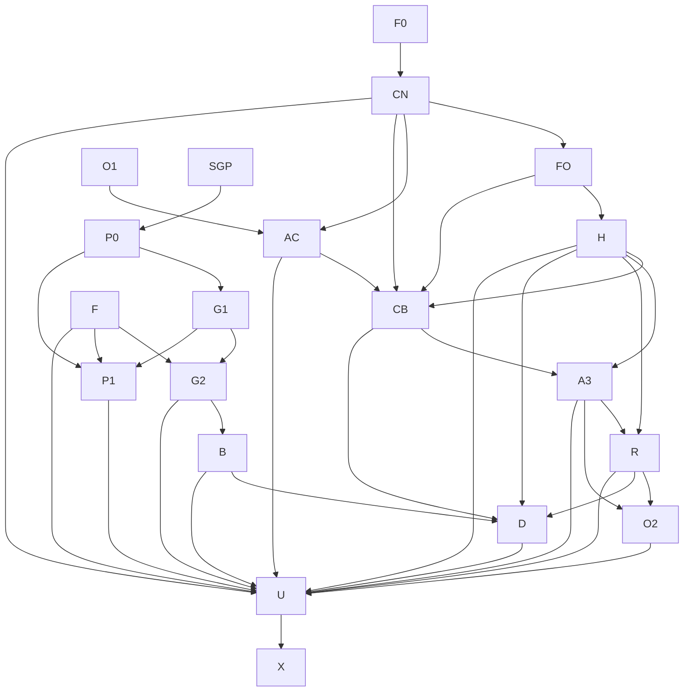

# OMERTÀ Grill Completion — Umbrella Implementation Graph and Traceability Manifest

**Date:** 2026-08-26  
**Authoritative requirements:** `docs/superpowers/specs/2026-08-26-grill-completion.md`  
**Purpose:** make every retained Grill interview decision reachable from a
tracked implementation node, review gate, deployment state, and final evidence
package. A disabled UI card, design paragraph, unsigned package, or passing
documentation-string guard is never implementation evidence.

## Completion boundary

“Complete” means the repository contains the requested implementation, focused
and integrated behavioral tests, migrations, truthful machine/API surfaces,
operator UI, deterministic deployment artifacts, rehearsals that can run
without production authority, and independent review with every Critical and
Important finding closed. It does not authorize this workstream to sign Safe
transactions, spend/fund production ETH or OMR, deploy contracts, change live
roles, or claim an audit/provider/finality fact that was not observed.

Every node carries four independent states:

1. `implementation`: pending / in progress / complete;
2. `review`: pending / needs fixes / approved;
3. `integration`: dormant / gated / integrated;
4. `deployment`: undeployed / deployed-unactivated / active.

No earlier state implies a later one. Current global deployment state is
**undeployed/unfunded/unsigned/unconfigured** for every Grill-v2 addition.

As of 2026-08-28, CN-5, FO Tasks 1–5, FO's follow-on `eventBlocks`
evidence extension, and Acquisition Constellation Tasks 2–4 are
implemented, independently approved, and dormant. That status proves no
production configuration, deployment, Safe execution, chain finality, funding,
or activation. Task 4 architecture, RED, GREEN, and verifier/crosswalk closure
are `080330e2`, `255bb57d`, `14bda2f6`, and `0b455987`. Focused verification is
27/27 passing, crosswalk verification is 57/57 passing, exact Task 4 phase
verification exits `0`, conforming-complete RED exits `44`, and independent
final security and specification reviews are C0/I0/M0.
Acquisition Constellation Tasks 5–9, H2, CN-6, and the broader interview scope
remain planned acceptance/implementation nodes rather than active production
consumers.
The Task 4 constellation is dormant, undeployed, unfunded, and unactivated;
final A1/A3/R and production approval remain pending.

## Requirement manifest

Every bullet under the cited master heading is binding. A row may become
complete only when all bullets in that heading have direct behavioral evidence;
partial legacy behavior and dirty documentation do not count.

| Requirement ID | Master section | Owning graph nodes | Current state |
|---|---|---|---|
| IB-1..IB-7 | Interpretation and completion boundary | F0, every node, X | F0 tracked; external-action boundary preserved |
| OV-1..OV-14 | Explicit override ledger | F0, O1/O2, R, G1/G2, B, P, X | Tracked; each consuming plan must restate applicable overrides |
| GI-AUTH | Global invariants / Authority separation | O1/O2, H, A, G1/F/P, U, X | Pending outside approved C/N and standalone pool slices |
| GI-CONS | Global invariants / Conservation and provenance | A1/A3/R/O2, D, G1/G2/B/P | Reserved-vs-reconciliation correction tracked; implementation pending |
| GI-FINAL | Global invariants / Finality, replay, and audit | FO, CB, H, R, G2, F, P, U | Shared kernel, getter consumer, and committed event-time evidence implemented/approved/dormant; typed registry/health consumers pending |
| GI-PROD | Global invariants / Product posture | A/CB/R/D/G/B/P/U/X | Pending; dormant/no-selling/no-APY posture tracked |
| C1 | Immutable asset identity/history | C/N Tasks 1–2 | Implemented and independently approved; dormant/undeployed |
| C2 | Activation approval and ballots | C/N Tasks 1, 4–7; H; A1 budget bridge | Registry/reviewer/database ballot implemented and independently approved/dormant; finalized lifecycle/integration pending |
| C3 | Finalized mirror authority | C/N Task 2, FO, Tasks 6–7 | Getter mirror, shared observation kernel, and event-time evidence implemented/approved/dormant; typed registry/health consumers pending |
| N1 | Nomination identity/cadence | C/N Tasks 3–4 | Implemented and independently approved; dormant |
| N2 | Support and seat authority | C/N Task 3; Commission seat-generation integration | Domain approved; rapid loss/reseat generation hook pending |
| N3 | Review and expiry | C/N Tasks 3–4, 6–7 | Domain/routes/package approved; finalized activation lifecycle pending |
| H | Health and operational quarantine | H1 watcher/domain; H2 additive overlay/finality; U | Pending; mandatory before non-dormant ballot/purchase/delivery |
| A1 | Native-ETH buckets/deposits | O1, AC-0..9 | O1/Task4 approved; Task5 `ee857436` is the approved dormant/nondeployable 23,212B oracle; AC Tasks 2–3 retain their recorded approvals; AC Task 4 architecture `080330e2`, GREEN `14bda2f6`, and verifier/crosswalk `0b455987` development-closed with final reviews C0/I0/M0; Tasks 5–9 and final A1/A3/R/production approval pending |
| A2 | mainOperator | O1 role/typed authority; O2 final debit integration | Pending; A2 cannot complete before A3/R |
| A3 | Purchase intents | CB budget bridge, A3 | Pending |
| A4 | Pause and deficit | AC, R, O2, U | Pending |
| R | Attempts/reconciliation/incidents/hold-only Stock Token | R1/R2, O2, D, U | Pending; no callable token sale/recovery path in MVP |
| D | Allocation/permanent deed delivery | D after CB/H/R/B | Pending; legacy Broker delivery is migration input only |
| G1.1 | Gameplay vault shape/buckets | P0, G1-core | Pending |
| G1.2 | Risk consent/loss | G1-risk | Pending |
| G1.3 | Settlement authorization/pause | G1-settlement, F, P | Pending |
| G1.4 | Solvency/unattributed OMR | G1-solvency | Pending |
| G1.5 | Upgrade governance | G1-governor | Pending |
| G2 | Controller recovery/migration/finalized journal/checkpoints | G2 | Pending |
| B | Broker seven-day finalized TWA/ruleset | B | Pending; mandatory input to D |
| P | Community settlement gas integration | reviewed pool, P0, G1, F, P1 | Standalone pool approved; integration pending |
| U | Public/operator API, workers, alerts, exports, graphical console | per-domain U tasks then U-console | Pending beyond approved C/N surfaces |
| X | Documentation/deployment/rehearsal/verification | X-CN per slice; X-global | Pending; no production claims authorized |

## Binding graph corrections

- **Health first:** H gates every non-dormant ballot open/cast/publish, purchase
  broadcast, and Stock Token delivery. The current database ballot work remains
  dormant until H is integrated. `RWA_STOCK_PIPELINE` is a future explicit
  cutover selector name; no such selector exists in current production code, so
  the legacy routes/worker remain the only reachable production path.
- **Finality kernel before health:** FO owns only exact-head RPC observation,
  complete bounded log retrieval, event block-hash verification, getter pinning,
  the same-block canonical event timestamp committed as `eventBlocks`, and
  before/after finalized-head recheck. The kernel/getter/event-time slice is
  implemented, independently approved, and dormant. It lands after CN-1..4 and
  before H, preventing a cycle where H waits for CN-6 while CN-6 waits for H.
  Registry and health consumers retain separate identities, locks, typed
  inboxes/checkpoints, reducers, and readiness; they cannot advance or clear one
  another.
- **Bounded head coherence:** when catch-up is chunked, FO pins logs and getters
  to the same bounded target `N`, reports the later finalized horizon separately,
  and marks caught-up only when they meet. One exact trusted-RPC bounded-range
  response is the operational completeness boundary; no cryptographic
  non-omission/quorum claim is fabricated.
- **Applied means applied:** a consumer's last-applied checkpoint advances only
  in the same transaction that inserts immutable inbox evidence and applies its
  typed domain transition. A split design must expose separate observed/applied
  cursors and readiness follows applied state.
- **Additive clearance authority:** the registry-v2 ABI stays frozen. A separate
  `RwaHealthOverlay` supplies exact seven-day Safe clearance and finalized event
  evidence; an off-chain flag alone never clears quarantine.
- **Budget bridge:** Task 5's manual `maxEthWei` opener is temporary dormant
  preparation. Production opening must consume/verify AcquisitionVault budget
  provenance; the post-ballot intent consumes that immutable ceiling. Both H2
  readiness and AcquisitionVault-backed pre-vote budget provenance are mandatory
  before the CN-6 publisher can become reachable.
- **Split operator delivery:** O1 owns appointment, zero-disable, renounce,
  replacement, generations, consent and nonces. O2 implements arbitrary ETH
  only after A3 reservations and R reconciliation liabilities exist.
- **Reserved is not reconciliation:** ordinary pre-attempt reservations are
  cancelled whole under the deterministic rule and create no shortfall.
  Reconciliation-pending liability survives while backing falls and shortfall
  rises. Schema, events, previews, incidents, UI, and rehearsals must keep them
  distinct.
- **Allocation waits for stake authority:** D depends on the finalized B
  ruleset/checkpoints because the formula consumes `stakeMult`.
- **Pool interface before vault ABI:** P0 freezes the pool/vault interface and
  deployment-address ceremony before G1 settlement is finalized. The pool hook
  remains isolated and post-economic-effect.
- **Finality rules are explicit authority:** node F owns the one public
  settlement-finality threshold and Safe-only 48-hour delayed, prospective
  changes. G2, P, U, and X consume it.
- **Immutable pool sequence compatibility:** the standalone pool contract is not
  retrofitted. Its finalized server mirror assigns the global accounting
  sequence while preserving exact contract event identity and totals.
- **Seat term identity:** Commission seat generations must prevent a rapid
  loss/reseat from reviving prior support; the current generation-less mirror is
  not final acceptance evidence.

## Executable dependency graph

The size-triggered amendment
`docs/superpowers/plans/2026-08-27-acquisition-constellation.md` supersedes the
single-vault implementation node. In this graph `AC` means the phase-deployed,
atomically finalized immutable constellation: Factory, Authority, Core,
BudgetBook, Intent, and Reconciliation. The historical `A1` monolith is only a
behavioral oracle and is not a deploy node.

## Node ledger and gates

| Node | Produces | Depends on | Acceptance gate | State |
|---|---|---|---|---|
| F0 | Master spec, this manifest, override/conflict rulings | Interview recovery | No orphan section; ignored-only rulings promoted | Complete; keep current |
| CN-1..4 | Registry, getter catalog, nominations, reviewer routes/packages | F0 | Focused tests + independent reviews | Complete/approved/dormant |
| CN-5 | Immutable DB ballot/tally/budget evidence | CN-1..4 | BigInt/time/snapshot/concurrency/literal-ABI tests | Complete/independently approved/dormant; manual budget is not production provenance |
| FO | Shared exact-head finalized-observation kernel, getter consumer, committed event-block timestamps, and consumer checkpoint/inbox contract | CN-1..4 | Pinned getter/log/event-time completeness, hash-recheck, reorg/crash/gap/bound/replay tests | Tasks 1–5 plus event-time fix complete/independently approved/dormant |
| H1 | Predicate taxonomy, watcher, snapshots, operational overlay domain/API | FO, CN-1..4 | 5-minute poll, 10-minute freshness, bounded work, spam/stale tests | Pending |
| H2 | `RwaHealthOverlay`, seven-day Safe clearance package/finality | H1, FO, CN-1..4 | Contract tests, exact event/finality/reorg proof | Pending |
| O1 | mainOperator role state machine and EIP-712 authority | F0 | Unit/fuzz/invariant/1271/generation/nonce tests | Complete/independently approved/dormant at remediation head `82001b6e8ac54c46dda6eb185cda550e8a73a3de`; no outflow or deployment |
| A1-ref | Monolithic behavioral oracle for authority, buckets, ingress, deposits and caps | O1, CN | Preserve O1/Task4/Task5 evidence; never deploy | Task5 oracle `ee857436`, runtime 23,212B, independently approved and dormant/nondeployable; Task 4 fresh BudgetBook evidence slice closed through GREEN `14bda2f6` and verifier/crosswalk `0b455987`; Tasks 5–9 pending; not final A1/A3/R approval |
| AC-0..9 | Immutable acquisition constellation: manifest factory, Authority, Core, BudgetBook, Intent, Reconciliation, O2 integration and review | A1-ref, O1, CN | Exact crosswalk; phased CREATE/finalization; typed-call/stateful/size/replay/gas tests; independent Wildcat/controller approval | Tasks 0–4 development-closed through Task 4 verifier/crosswalk `0b455987`; dormant, undeployed, unfunded, and unactivated; Tasks 5–9, broader interview scope, and final A1/A3/R/production approval pending |
| CB-bridge | Core/BudgetBook provenance into ballot opener/cutover gate | CN-5, AC-0..4, H2 | No manual production budget, no fallback/double authority | Pending |
| CN-6 | One-cursor RegistryV2 finalized lifecycle consumer plus dormant exact-byte publisher | FO, CN-5, H2, CB-bridge | Event-time/reorg/crash/exact-match/drift/exact-byte rebroadcast tests; no duplicate observation kernel | Pending; publisher unreachable until H2 and AcquisitionVault provenance are approved |
| CN-7 / X-CN | Real-PG harness, machine surfaces, C/N runbook/deploy package/review | CN-6 | MVCC/deadlock evidence; honest dormant manifest; whole-slice review | Pending |
| A3 | Purchase intent/reservation/oracle/adapter/expiry/cancel execution | AC-0..5, CN-6, H2 | Constellation typed-call/unit/fuzz/invariant/oracle/route/replay tests | Pending within Intent/Core extraction |
| R | Attempt journal, reconciliation, incidents, hold-only unmatched Stock Token | AC-0..6, H2 | Phase-hook/finality/reorg/repair/shortfall/bounded-index tests | Pending within Recon/Core extraction |
| O2 | Fully integrated arbitrary ETH debit | AC-0..7 | Shared-nonce, 0/1/32/67, whole-reservation cancellation and surviving reconciliation invariants | Pending within constellation integration |
| P0 | Pool/vault interface and deterministic address/latch ceremony | approved SGP | ABI/circular-deployment and code-pin review | Pending |
| G1 | Gameplay vault core/risk/settlement/solvency + governor/proxy | P0 | Unit/fuzz/stateful invariant/size/storage/upgrade tests | Pending |
| F | Settlement finality rules contract/mirror/packages | G1 interface | 48-hour proposal, future effective block, symmetric change tests | Pending |
| G2 | Finalized journal, crash/reorg recovery, controller recovery/migration/checkpoints | G1, F | Reorg/crash/migration/checkpoint continuity tests | Pending |
| B | Seven-day finalized OMR principal TWA and 1.50x max ruleset | G2 | Epoch/ruleset/tie/collision/TWA tests | Pending |
| P1 | Permissionless settlement and community gas hook integration | G1, F, P0 | Winner/replay/zero-loot/partial/empty/hook-isolation tests | Pending |
| D | Atomic-unit allocation, deeds, holds, FIFO delivery, operations gas | CN-6, H2, R, B | Conservation/property-binding/finality/per-item isolation tests | Pending |
| U-domain | Complete public/operator APIs, workers, alerts, exports | Each domain | Auth/idempotency/bounds/stable-error/authority matrix tests | Pending |
| U-console | Graphical operations console | U-domain | Browser/accessibility/preview/persistent-red/finality visual tests | Pending |
| X-global | Manifests, deploy scripts, rehearsals, docs/knowledge, security reviews | All nodes | Full Node/Forge/real-PG/static/knowledge/audit review | Pending |

## Implementation discipline

1. Only one implementation task edits the shared integration worktree at a
   time. Read-only preflight/coverage/security analysis may run in parallel.
2. Every implementation task begins with a bounded brief and real RED evidence,
   ends in one focused commit/report, then receives an independent review.
3. Critical and Important review findings block the next dependent node. Use at
   most five implementation/review fix loops before recording a true blocker.
4. Shared schema/route/knowledge/contract edges are integrated in graph order.
   No task fabricates addresses, signatures, finalized blocks, funding or audit
   evidence.
5. Legacy and v2 state are never translated into each other when immutable
   identity is absent. Cutovers are explicit selectors with no fallback or
   double-running authority.
6. Dirty main-worktree founder prose/UI is reconciled hunk-by-hunk only after
   behavioral surfaces exist; never reset/stash/overwrite it or touch the
   unrelated whitepaper.

## Final evidence package

X-global must publish a traceability ledger linking every requirement row above
to implementation commits, focused tests, deliberate mutation evidence,
independent review verdicts, integrated suite results, deployment manifest
state, and any genuinely external pending ceremony. It must explicitly state
which of `implemented`, `reviewed`, `rehearsed`, `deployed`, `funded`,
`configured`, `Safe-executed`, `finalized`, and `active` are proven. Silence is
never treated as success.
