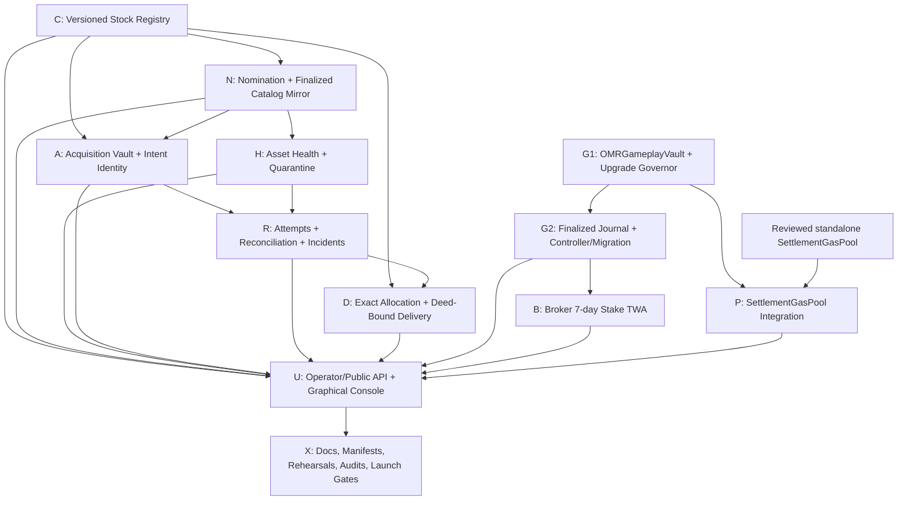

# OMERTA Grill Interview Completion Specification

**Status:** Binding implementation specification assembled 2026-08-26 from the
retained Grill v2 interview, its handoff attachment, the repository's dirty
design amendments, and the verified implementation baseline.

**Goal:** Implement every product and architecture decision that received an
unambiguous founder answer in the Grill interview, preserve every explicit
override, expose the resulting operations graphically, and finish with
behavioral tests, invariants, security review, deployment tooling, and honest
launch gates.

**Primary interview sources:**

- `C:/Users/Jorge/.codex/sessions/2026/08/25/rollout-2026-08-25T00-49-50-01a03740-d43a-72d3-a43b-e3bb91da57c8.jsonl`
- `C:/Users/Jorge/.codex/attachments/bd995375-f17f-4cbf-8829-b8f38e3df8ea/pasted-text.txt`
- `C:/Users/Jorge/Documents/Omerta/omerta-rwa-stock-machine-design.md`
- `C:/Users/Jorge/Documents/Omerta/omerta-brokers-design.md`
- `C:/Users/Jorge/Documents/Omerta/CHAIN-DEPLOY.md`

The first two paths are immutable recovery evidence. The latter three are a
dirty, user-owned documentation worktree and must not be reset, overwritten,
or treated as proof that the described runtime exists.

## Interpretation and completion boundary

1. A direct prose answer controls an ambiguous numeric `Y/N` token in the same
   answer.
2. A later, more specific decision controls an earlier general recommendation.
3. Omitted questions are not approvals. They are implemented only where a later
   explicit answer resolves the same issue.
4. Documentation assertions and disabled UI cards are requirements artifacts,
   not behavioral implementation.
5. Production deployment, Safe signatures, provider credentials, treasury
   funding, token movement, and live role changes are irreversible or external
   security-sensitive acts. This implementation completes their code, tests,
   manifests, unsigned transaction preparation, rehearsal, and runbook gates;
   it does not perform them without a separate explicit authorization.
6. Repository code and every existing launch surface pin Robinhood Chain ID
   `4663`. The retained interview did not contain a direct answer to the
   canonical-chain question. For this implementation, `4663` is a repository
   compatibility constraint, not a claim that the missing interview answer was
   recovered.
7. The current feature baseline includes the reviewed standalone
   `SettlementGasPool`. It is a completed dependency, not a deployed service.

## Explicit override ledger

These rulings are load-bearing and must be copied into every affected plan.

| Earlier proposal | Controlling decision | Required implementation |
|---|---|---|
| Acquisition ETH can never be swept | Founder requires `mainOperator` to move any/all acquisition-vault ETH arbitrarily | Normal acquisition accounting remains strict, but the one public operator may transfer actual native ETH with complete public deficit/accounting consequences |
| Safe-delayed replacement for every operator change | Active operator may replace itself instantly | Direct-only atomic replacement with same-transaction EOA/ERC-1271 successor consent; Safe delay remains for Safe appointment from disabled/zero state |
| Add an ETH burn category | Founder sees no valid burn scenario | Reject zero recipient; no burn function or burn reason |
| Broad acquisition operator authority | Gameplay OMR remains restricted | `mainOperator` has no OMR, Stock Token, allocation, gameplay-vault, gas-pool, upgrade, or recovery-sweep authority |
| Build generalized RWA token recovery now | Founder says this edge case is overengineered | Launch exact-provenance `unattributed_stock` as hold-only and excluded from inventory; retain approved safeguards as a conditional future spec, but expose no callable recovery path now |
| Recovery must be non-upgradeable | Founder rejected that restriction | If later enabled, a recovery proxy/implementation is permitted only with exact code/implementation pinning and all approved anti-blackhat gates |
| Gameplay vault should be non-upgradeable | Founder rejected it | Transparent proxy plus dedicated non-upgradeable, Safe-only, delayed upgrade governor |
| Old `OMRStaking` and database stake remain authoritative | All game-internal stake must use on-chain OMR | New `OMRGameplayVault` is canonical; database values are finalized mirrors/journal only; no personal APY |
| Permissionless settlement with protocol gas was rejected as one bundle | Founder later explicitly chose permissionless execution and community pooled gas | No relayer registry; invalid/stale/losing calls self-pay; only a canonical winning settlement may record a capped pool credit |
| Finality changes have asymmetric timing | Founder rejected asymmetry | Every increase and decrease is Safe-only, exact-package, 48-hour delayed, and prospective |
| Two RWA reviewers | Founder said one suffices | One authenticated authorized RWA reviewer may set a terminal review disposition; the Safe remains separate activation authority |
| 2.0x or 3.0x stake multiplier proposals | Later exact ceiling and tiers | Maximum `1.50x`; `<300=1.00x`, `300-999.999...=1.10x`, `1,000-4,999.999...=1.20x`, `5,000-19,999.999...=1.35x`, `20,000+=1.50x` |

## Global invariants

### Authority separation

- The Safe owns registry curation, delayed acquisition configuration,
  reconciliations, gameplay upgrades, exact unattributed-OMR recovery, and
  finality/risk-parameter governance.
- The single `mainOperator` has broad native-ETH authority only in the RWA
  acquisition vault. It cannot make a catalog version active, rewrite a ballot,
  reconcile facts, move Stock Tokens, move OMR, upgrade contracts, select a
  settlement executor, or sweep community gas.
- RWA health watchers can only remove operational permission and publish facts.
  They cannot create approval, clear Safe-deactivation, redirect custody, or
  rewrite canonical chain results.
- Gameplay settlement is permissionless. The signer authorizes one exact
  outcome; the submitter has no economic discretion and receives gas credit
  only after that outcome becomes the canonical winning state transition.
- Browser UI never holds or implies Safe authority. It may prepare exact
  unsigned packages, display evidence, and submit actions already authorized by
  an authenticated operator or signed typed instruction.

### Conservation and provenance

- Every financial mutation has a monotonic `accountingSequence` and publishes
  pre/post totals plus stable component/event identifiers.
- Canonical deposits are unique by chain, approved ingress version, and source
  reference. Unexplained native balance is `unattributed`, not available.
- RWA liability, backing, and shortfall remain explicit even after the operator
  transfers the underlying ETH. Moving value never erases what the protocol
  owes.
- Purchased Stock Token success is the exact positive custody delta of the
  immutable ballot-selected token. A positive fill is terminal; there is no
  top-up or substitution.
- Stock allocations conserve exact token atomic units. Integer floors are
  followed by deterministic largest-remainder distribution. Zero-unit rows are
  retained and public.
- Gameplay-vault liabilities remain full. Deficit creates no haircut or
  write-off. Bypass token transfers become unattributed; explicit
  `fundDeficit(amount)` applies actual receipt to deficit first.
- No personal APY, synthetic stake, database-created OMR, or gas charge against
  player OMR is allowed.

### Finality, replay, and audit

- Only finalized canonical chain events become authoritative server mirrors.
- Every chain mirror detects reorgs, sequence gaps, and staleness. A critical
  mirror older than ten minutes is red and disables new risk while recovery,
  accounting, direct withdrawal, and authorized RWA operator outflow remain
  available where specified.
- Every EIP-712 action binds chain, verifying contract, exact actor/account,
  generation, monotonic nonce, issued time, deadline, and action-specific data.
- EOA and ERC-1271 validation fail closed on malformed, reverting, or incorrect
  responses.
- Failed adversarial calls do not create permanent history, incidents, pauses,
  reservations, tombstones, or resource consumption.
- Public audit views distinguish provisional from finalized state; finalized is
  the default. Recent pages are bounded; complete exports are checksummed and
  reconstructable in `accountingSequence`, `componentIndex`, stable-event order.

### Product posture

- Human Broker qualification stays server-authoritative: at least three
  distinct activity tracks and score 25, then uncapped linear activity; failed
  actions, presence, client telemetry, agents, NPCs, and residents do not count.
- No in-game recipient KYC/residency/sanctions gate is added. This is a
  founder-directed product/risk posture, never a statement of legal clearance.
- Pending allocations never expire or forfeit through inactivity, death, or a
  missing extracted property destination.
- MVP RWA acquisition has an exact pre-ballot maximum budget, no revenue-share
  sizing, reserve floor, minimum economic purchase floor, selling, rebalancing,
  market timing, or leverage authorization. It buys provider-native spot Stock
  Tokens only.

## Dependency graph

Independent source changes may be analyzed in parallel. Implementation tasks
that share contracts, schema migrations, route modules, or generated knowledge
artifacts are integrated sequentially and reviewed at each graph edge.

## C — Immutable versioned Stock Token registry

Implement this as additive `StockTokenRegistryV2` contract and v2 mirror tables.
Do not mutate the deployed/dormant legacy ticker-key ABI into a different key
meaning. Legacy contracts remain migration inputs until the release slice proves
cutover.

### C1. Identity and history

- An immutable asset version binds supported chain ID, normalized ticker, exact
  token address, and RHJ provider asset ID hash.
- Its key is exactly
  `keccak256(abi.encode(chainId, keccak256(bytes(normalizedTicker)), token, robinhoodAssetIdHash))`.
- Normalization is ASCII uppercase ticker text with no empty value; contract and
  server tooling must independently recompute and cross-check the key.
- A new token, provider ID, ticker, or supported chain produces a new version.
  Existing version identity is never overwritten.
- Inactive history remains enumerable and may repeat a ticker/token/provider
  field. The active set permits at most one record for each normalized ticker,
  token address, and provider ID.
- One Safe transaction atomically deactivates every active conflict and
  activates the exact target version, or reverts with no intermediate state.
- Reactivating the same version does not duplicate history.

### C2. Activation approval and ballots

- Safe activation authorization binds exact version key, evidence hash, review
  ID, and `validUntil = approvedAt + 7 days`; canonical inclusion must be
  strictly before `validUntil`. Inclusion at or after the boundary is stale.
- The server labels activation lifecycle separately:
  `approved -> safe_submitted -> executed_pending_finality -> synced_active`,
  with `approval_stale`, `reorged`, and failed states kept public.
- Only `synced_active` versions are voteable. Optimistic receipts are not.
- An empty active catalog refuses ballot casts/publication, creates a durable
  public `catalog_empty` skipped day, spends nothing, and never revives a static
  fallback.
- Family votes can target only the current finalized active version key. If that
  version leaves the active set before close, only those votes are invalidated;
  families may recast before the unchanged cutoff. The day is not restarted or
  extended.
- A closed ballot binds exact version key, exact token, exact frozen maximum ETH
  budget, and public tally hash. It is immutable history.
- A winner that becomes ineligible after close is skipped without substitution,
  republishing, replay, or ticker redirection. Its ETH remains in the general
  non-expiring acquisition pool.
- The registry enforces that non-revival with a monotonic activation generation:
  publication snapshots the selected version's generation and requires its
  current activation to predate the UTC close boundary. Live resolution requires
  the exact snapshot. Deactivation followed by same-key reactivation can never
  restore that ballot's purchase authority.
- The one-time launch catalog tooling ranks eligible RHJ assets by official
  underlying `dailyTradingVolume`, selects the top 15, and generates an unsigned
  Safe activation package. It never automatically rotates the live catalog when
  later volume rankings change.

## N — Public family nomination and review lifecycle

### N1. Nomination identity and cadence

- A currently seated boss or underboss may create at most one new nomination
  per family in any rolling 168-hour window.
- A nomination binds the exact C-version key, immutable sponsor family, evidence
  snapshot/hash, rationale, `createdAt`, and immutable
  `pendingUntil = createdAt + 30 days`.
- A database uniqueness constraint permits at most one nonterminal pending
  nomination citywide per version key.
- A duplicate submission returns the existing nomination plus an explicit
  endorsement action; it neither inserts a row, silently endorses, nor consumes
  the weekly nomination allowance.
- Same-ticker/different-version nominations may coexist and are visibly marked
  as conflicts.

### N2. Support and seats

- Sponsor counts once only while currently seated and has no separate
  endorsement slot.
- Every other currently seated family has one mutable endorsement slot per
  pending nomination. Boss or underboss may create, change, or withdraw it.
- Seat authority is checked in the same transaction as every write. Seat loss
  removes current support immediately without deleting event history; reseating
  does not restore support automatically.
- A valid nomination survives seat loss or family dissolution until ordinary
  terminal disposition/expiry, but the former family loses write authority.
- Three distinct currently seated supporting families is a fixed, unscaled
  procedural threshold even with vacancies.

### N3. Review and expiry

- Before claim, support `>=3` yields `review_requested`; falling below three
  demotes the signal. An authorized reviewer may manually claim any pending
  nomination below threshold.
- Review queue order is current support descending, creation time ascending,
  stable nomination ID ascending.
- One authenticated authorized RWA reviewer may claim and independently set
  `approved`, `rejected`, or `not_eligible`. This never itself changes the
  on-chain registry or a ballot.
- `pending`, `review_requested`, and `under_review` all expire at the original
  immutable 30-day boundary. Review work never extends it.
- A terminal disposition before the boundary does not expire. Approval remains
  non-voteable until C's Safe execution, finality, and sync finish.
- A stale/missed activation needs a fresh linked nomination and evidence; old
  approval calldata cannot be regenerated.

## H — Asset health and operational quarantine

- The watcher evaluates every active version at least every five minutes and
  synchronously before ballot publication, purchase broadcast, delivery start,
  and quarantine-clearance broadcast.
- A health snapshot older than ten minutes is unusable.
- Verified material drift imposes `operational_quarantine`; timeout, malformed
  response, signature/identity mismatch, or inability to verify a critical
  prerequisite imposes `health_unknown`.
- A deterministic watcher rule or one authorized RWA reviewer may enter either
  state immediately, idempotently, with original timestamp, rule/reason,
  observation, reviewer if any, and hash-addressed evidence.
- Quarantine blocks new ballots/votes/purchases and automatic affected delivery.
  It does not mutate the registry, confiscate holdings, expire allocations, or
  substitute another asset.
- Clearing an overlay on a still-active registry version requires fresh evidence,
  one reviewer, exact TTL-bound Safe clearance, finality, and sync. A
  Safe-deactivated version requires a fresh linked nomination with no carried
  support.
- If quarantine is known before purchase broadcast, the intent is skipped. If
  imposed after broadcast, preserve canonical results and record
  `purchase_at_risk`; an unprovable ordering is `ordering_uncertain`.

## A — RWA acquisition vault, main operator, and purchase intents

### A1. Native-ETH buckets and deposits

- One dedicated acquisition vault accounts native ETH as `available`,
  `unattributed`, `reserved`, and `reconciliationPending`, plus explicit
  liability, backed liability, and shortfall totals.
- Approved ingress versions are pinned to address, runtime code hash, and, where
  applicable, proxy implementation address/code hash. Exactly one ingress
  version is active with no overlap.
- Only an approved ingress may create a canonical deposit, unique by chain,
  ingress version, and source reference. Forced/unmatched ETH is unattributed.
- Safe reclassification moves exact unattributed accounting into available but
  transfers no ETH and bypasses no acquisition wall.
- During deficit, a canonical deposit repairs shortfall first and sends the
  exact residual to available under the same deposit ID. Exact causal refunds
  repair their own shortfall first.
- Refund to an active intent restores its reservation; refund to a terminal
  fully accounted intent becomes available; unmatched refund is unattributed.

### A2. `mainOperator`

- Exactly one public address, or zero, is current. Safe may immediately set zero,
  which cancels a pending nomination, increments generation, and invalidates
  outstanding signatures.
- From zero/disabled state, Safe appointment is an exact public nomination with
  48-hour delay, nominee acceptance, and expiry seven days after it becomes
  acceptable. Cancel/expiry never appoints.
- Active operator may directly renounce to zero or directly and instantly
  replace itself with a nonzero different address. Replacement is never relayed.
- Replacement includes short-lived (maximum one hour) typed successor consent
  validated as EOA or ERC-1271 in the same transaction. It cancels a pending
  Safe nomination, increments generation, invalidates old signatures, preserves
  the global outflow nonce, and has no overlap.
- Direct and relayed native-ETH outflows share one global monotonic nonce domain.
  Operator may invalidate unused nonces. Relayed authorization maximum lifetime
  is one hour.
- Every outflow binds exact amount, destination, closed reason code, nonzero
  details hash, generation, nonce, issued time, and deadline. Zero destination
  is rejected. Transfer uses empty calldata and exposes no arbitrary call,
  ERC-20, approval, `delegatecall`, or burn surface.
- Debit accounting order is exactly `available -> unattributed -> reserved ->
  reconciliationPending`. The operator may transfer up to actual ETH even when
  accounting is already in deficit. Impacted reservations and liabilities remain
  public; outflow does not manufacture resolution.
- Every Safe/operator role transition binds a public reason code and nonzero
  details hash. Wallet health/code/module changes produce advisory warnings but
  do not silently revoke a valid operator address.

### A3. Purchase intents

- Exactly one deterministic intent exists per supported chain, acquisition
  vault, immutable closed ballot, and asset version. Its ID is exactly
  `keccak256(abi.encode(chainId, vault, ballotId, assetVersionKey))`. The active
  ingress version is an independently bound field and validation wall, not a
  way to create another intent. Terminal tombstones prevent replay.
- Intent creation occurs only after every budget, catalog, health, pause,
  finality, oracle, adapter, exposure, and accounting wall passes. Failed checks
  consume no ID, sequence, reservation, or tombstone.
- The exact pre-ballot maximum budget is frozen into the ballot/intent. There is
  no reserve floor, minimum purchase floor, daily catch-up stack, or ticker debt.
- Intent binds exact asset version/token, ETH maximum, independent oracle
  observations, minimum output, adapter address/runtime hash, bounded route
  commitment, deadline, and attempt nonce.
- Execution is permissionless and gives the executor no reward or discretion.
  Safe or current operator may cancel immediately without transferring ETH;
  operator cancellation may be direct or one-hour typed/relayed in a separate
  cancellation nonce domain.
- Anyone may execute deterministic expiry after its deadline. Cancellation and
  expiry are terminal and cannot revive or catch up.
- Passing checks and invoking the adapter consumes the attempt nonce/result.
  Failure before adapter invocation does not. Unexplained post-call deltas enter
  reconciliation.
- Provider-native spot purchase requires at least one independently governed
  Safe-approved fresh source that is not the venue/router/pool. When multiple
  valid sources exist, normalized values use their median. Every snapshot is at
  most five minutes old and binds source/asset/direction/decimals/quote/round and
  evidence. Safe-configured deviation is hard-capped at 500 bps. Adapter code is
  pinned and route data cannot select another token, recipient, or unbounded
  external target.
- Purchase completes only from the exact positive Stock Token delta in canonical
  custody. A zero delta fails. Positive partial output is the final fill.

### A4. Pause and deficit

- Safe or operator may pause new intent creation/execution; only Safe may unpause.
  Deposits, refunds, deterministic expiry, cancellation, reconciliation, direct
  operator outflow, and already-acquired delivery continue as specified.
- Accounting deficit pauses new automated buying, reservations,
  reclassification, and migration. It does not block actual-balance operator
  outflow.
- Finalized synchronized zero deficit clears only the deficit-caused blocker;
  manual/security/stale-mirror/quarantine blockers remain composed.

## R — Attempts, reconciliation, incidents, and hold-only token quarantine

- Every adapter attempt has immutable pre/post native and exact-token balances,
  intent/attempt identity, canonical result, and sequence evidence.
- Cancelled or expired uncertain attempts remain terminal while their backing
  stays `reconciliationPending` indefinitely. There is no timeout release.
- Operator may append evidence and a proposed disposition. Only Safe may finalize
  reconciliation. Contract-derived/capped canonical values constrain the closed
  disposition; Safe cannot invent deltas or recipients.
- Positive stock is a final fill with no top-up. Proven-unspent finalized ETH
  retires the exact liability and credits available. An underfunded factual
  result may close as `reconciled_shortfall` without erasing deficit.
- Shortfall attribution is deterministic: largest affected backing first, then
  oldest, then intent ID. Generic repair is oldest-first; exact causal repair
  retains priority.
- A positive shortfall opens/increments a persistent incident generation and
  pauses new purchase risk. No interest/compensation accrues.
- Incident acknowledgment by Safe/operator only silences repeated notifications.
  It never resolves accounting or clears red status.
- Incident closes only when every affected record, aggregate, sequence, finality,
  and mirror condition is finalized, synchronized, and zero/continuous.
- Index rebuild is permissionless, deterministic, chunked, and bounded.
  Financial mutations cap the number of components processed per transaction.
- Late/unmatched Stock Tokens enter exact-provenance `unattributedStock`, count
  toward conservative risk/exposure, and are excluded from usable inventory and
  distribution. MVP action is hold only. No callable sale, recovery adapter,
  arbitrary recipient, sweep, or retroactive allocation is deployed.
- Public incident data is structured; sensitive evidence remains hash-addressed.
  Failed spam cannot create incidents, pauses, or permanent history.

Conditional future recovery requirements remain documented but out of MVP:
immutable fully bound recovery ID, maximum one-hour/oracle-bounded expiry,
monotonic bounded partial execution, exact ephemeral allowance/direct transfer,
permissionless no-benefit executor, separate operations gas, two independent
prices within 500 bps, standard ERC-20 only, zero residual balance/allowance,
chain-derived history, rate limits, failed-spam isolation, code-pinned
proxy/implementation, bounty/monitoring/runbook gate, and canonical-ETH-only
success.

## D — Exact allocation and permanent Street Deed delivery

- Distribution input is the exact canonical custody delta from one completed
  intent and the frozen Broker epoch rules; no later treasury balance is swept
  into the cohort.
- Final weight is `activationMult * activityScore * stakeMult`. Ordinary capital
  spend adds no weight. OMR stake multiplier is defined in B.
- Convert the purchased token amount into exact token atomic units using the
  token's verified decimals. Allocate by floor, then assign remaining units by
  descending fractional remainder, with stable account ID as the final tie
  breaker. Persist zero-unit rows and prove allocated sum equals acquired units.
- Each allocation permanently binds the immutable asset version and the selected
  extracted Street Deed/TBA destination. It cannot be redirected later. Rights
  travel with the deed if it is sold. A protocol-wide one-to-one migration may
  change destination semantics only through an explicit audited migration.
- Missing deed/TBA, death, inactivity, or delay creates a permanent pending row;
  it never forfeits, expires, or redistributes.
- User may set reversible global or per-version delivery holds. Holds preserve
  priority/ownership and cannot reverse a broadcast transfer.
- Operational quarantine pauses affected delivery. After finalized synchronized
  clearance plus a fresh health check, backlog resumes by original allocation
  time then stable allocation ID.
- Irrecoverable inability becomes `delivery_impossible_pending_resolution`; any
  later compensation derives only from value actually recovered from that exact
  holding.
- Delivery uses a separate native-ETH operations budget, never a user fee,
  holding deduction, acquisition budget, OMR stake, or gameplay gas pool.
- Per-item delivery failure is isolated; token-wide or conservation failure
  halts the affected run. Finalized confirmation is idempotent.
- Post-close purchase deadline is two hours. A failed/short purchase retains exact
  refund-pool accounting; no substitution or later cohort capture.
- Corporate-action multiplier updates preserve raw units. Terminal corporate
  actions remain Safe-reviewed until RHJ exposes a concrete audited interface;
  successor value follows original accounts pro rata and never becomes general
  treasury or a later cohort.

## G1 — `OMRGameplayVault` and upgrade governor

### G1.1 Contract shape and buckets

- New purpose-built vault replaces the yield-oriented `OMRStaking`; it pays no
  personal APY. OMR is a pinned standard ERC-20 and every transfer uses
  `SafeERC20` plus exact actual-delta checks. Fee/rebase behavior fails closed.
- Permanent nontransferable game account ID maps to one current controller
  wallet and generation. EOA and ERC-1271 are supported.
- Only current verified controller or an exact claim-and-stake rail may credit an
  account. Third-party named deposits are rejected. Direct/bypass transfers are
  unattributed.
- Account value is held in explicit idle, active, committed, and unbonding
  tranches. Lifecycle is
  `pending -> active -> committed` or
  `pending/active -> unbonding -> withdrawable -> withdrawn` as applicable.
- Unbond duration is six hours. Partial amounts are supported. At most 16 live
  unbonding tranches exist. Partial operation minimum is `0.01 OMR`, except an
  exact full-remainder exit.
- Mature tranches expose aggregate withdrawable while preserving tranche history.
  Withdrawals go only to current controller and are directly permissionless.

### G1.2 Risk consent and loss

- User accepts a versioned immutable on-chain risk ruleset before exposure.
  Safe may reduce exposure immediately. Any harsher rule is prospective, needs
  fresh consent, and preserves an exit under prior terms.
- Vault calculates the loss from execution-time balances; signer never supplies
  an arbitrary debit. Maximum debit is 20% of active/committed eligible balance
  and 50% of idle/unbonding eligible balance under the consented ruleset.
- Rounding is down. Actual loss is `min(calculatedLoss, eligibleBalance)` and a
  zero-loot outcome still consumes the exact event/nonce once.
- Multi-bucket loss is atomic and deterministic. Unbonding loss consumes earliest
  unlock first, then tranche ID for ties, exhausting a tranche before the next.
- Loot credits the killer exactly once into on-chain idle gameplay balance.

### G1.3 Settlement authorization and pause

- One-use EIP-712 outcome binds event ID, victim/killer account IDs, exact next
  victim settlement nonce, parties/controllers as needed, source buckets/rate,
  ruleset version, signer generation, issued time, deadline, and chain/vault.
- Authorization age is at most five minutes. `prepared` does not lock funds.
- One authorization settles one outcome; no batching. Any address may submit.
- Chain-first journal state is
  `prepared -> submitted -> finalized -> game_committed`. Gameplay consumes no
  irreversible resource before finalized canonical settlement; outages fail
  before consumption.
- Routine signer rotation gives the old signer a five-minute overlap only for
  authorizations issued before rotation. Emergency Safe revocation has zero
  overlap.
- Separate pause bits govern deposits, commitments, settlements, and withdrawals.
  Ordinary incidents keep exits open. Only a declared custody deficit/integrity
  blocker stops withdrawal.

### G1.4 Solvency and unattributed OMR

- Pre/post every mutation, actual OMR balance must cover full liabilities unless
  the operation is the explicit deficit-repair path.
- Permissionless `syncSolvency` and `syncUnattributed` surface bypass transfers,
  deficit, surplus, and incident generations.
- Positive deficit automatically blocks withdrawals, deposits, commitments, and
  debits; liabilities receive no haircut. Finalized synchronized zero clears only
  the deficit-created blocker.
- Permissionless `fundDeficit(amount)` credits no player, repairs deficit first,
  and classifies excess as unattributed.
- Unattributed OMR is nonqualifying and nonspendable. Safe may recover an exact
  amount only to one fixed OMR treasury through an exact public 48-hour proposal.
  `mainOperator`, signer, server, and relayer have no path.

### G1.5 Upgrade governance

- Vault is deployed behind OpenZeppelin Transparent Proxy with dedicated
  ProxyAdmin.
- ProxyAdmin is owned only by a small non-upgradeable
  `GameplayVaultUpgradeGovernor`.
- Safe alone proposes, cancels, and executes. Every upgrade and governor-control
  operation waits exactly 48 hours and binds implementation address, runtime code
  hash, compiler/config/evidence hash, exact `upgradeAndCall` calldata,
  post-upgrade validation commitment, earliest time, and execution expiry.
- No emergency upgrade bypass. Emergency action is pause only. Rollback is a new
  full delayed proposal.
- Implementation initializers/reinitializers are disabled. Execution performs
  exact initialization and atomic continuity/solvency/authority/storage-version
  validation or reverts.

## G2 — Controller recovery, migration, finalized journal, and checkpoints

- Healthy controller rotation requires old and new EOA/ERC-1271 consent and
  increments generation without resetting settlement nonce/history.
- Lost-wallet recovery requires permanent game-account authentication plus new
  wallet proof, seven-day public delay, notifications, old-controller veto, and
  Safe adjudication only when contested. Operator cannot accelerate it.
- Pending recovery freezes withdrawals, deposits, commitments, and controller
  changes; existing exposure/loss and unbonding clocks continue.
- Finalized vault events are the sole crash-recovery authority. Backend journal
  records prepared/submitted/finalized/game-committed separately and reorgs back
  only noncanonical derived state.
- Per-account finalized principal checkpoints support Made Ladder and Broker TWA.
  A permanent account maps to one qualifying controller wallet per epoch.
- Legacy stake migration credits only against OMR actually deposited into the new
  vault. It never mints or creates reserve deficit; any shortfall is published and
  remains unmigrated.
- Existing database stake routes become orchestration/mirror surfaces for the
  on-chain lifecycle. They cannot mutate canonical stake independently.

## B — Broker stake multiplier

- Final Broker weight is `activationMult * activityScore * stakeMult`.
- Eligible principal is finalized active plus committed OMR only. Idle,
  unbonding, liquid, reward, activation spend, database-only values, and
  unattributed OMR do not count.
- `stakeMult` uses finalized prospective seven-day time-weighted average:
  `<300 OMR = 1.00x`; `300-999.999... = 1.10x`;
  `1,000-4,999.999... = 1.20x`; `5,000-19,999.999... = 1.35x`;
  `20,000+ = 1.50x`.
- No extra maturity delay. One wallet can qualify one account per epoch;
  collisions fail closed and are public.
- Safe tier/rules changes require seven days' notice and become effective only at
  a future full epoch. Every epoch freezes one exact ruleset and final block.
- Public evidence includes account commitment, qualifying wallet commitment,
  finalized range/checkpoint root, TWA principal, tier, rules hash, and weight
  inputs without exposing unnecessary private identifiers.

## P — Settlement gas-pool integration

- Use the reviewed non-upgradeable standalone `SettlementGasPool`; do not add a
  relayer registry, sponsor refund, owner sweep, OMR authority, or RWA authority.
- Gameplay vault measures only the audited canonical settlement span, adds the
  immutable audited overhead in the pool, and passes the successful outer
  `msg.sender` as executor.
- Pool credit hook occurs only after every canonical gameplay economic effect is
  committed. A pool revert/out-of-gas/malformed behavior is isolated and cannot
  revert the settlement.
- Exactly one event/victim/nonce key is processed, including zero loot. Invalid,
  stale, replayed, or losing submissions cannot record credit.
- Pool exhaustion yields partial/zero credit and never freezes settlement.
- Chain-native data fee remains disabled until a separately reviewed code-pinned
  source and launch ceremony exist.

## U — API, workers, alerts, exports, and graphical operator console

- Add public read APIs for versioned catalog, nominations/support/review states,
  finalized lifecycle, health/quarantine, ballots/skips, intents/attempts,
  accounting buckets/sequences, incidents, allocations/deliveries, gameplay
  vault/controller/recovery/solvency, Broker checkpoints, settlement state, gas
  credits, and finality rules.
- Add authenticated operator APIs only where the caller has underlying authority:
  review disposition, quarantine entry, outflow package construction/relay,
  intent cancel/package, reconciliation proposal, incident acknowledgment,
  watcher retry, delivery operations, settlement orchestration, and exact Safe
  proposal preparation.
- Every mutating HTTP route uses stable error codes, idempotency, transaction-time
  authority rechecks, bounded work, and no secret in public evidence.
- Worker health and stale/gap state are persisted; risky automation fails closed.
- Activate the graphical Acquisition Desk's currently disabled panels only after
  the corresponding behavioral route exists. Include catalog/nominations,
  ballot/purchase pipeline, main-operator ETH and deficit preview, reconciliation,
  persistent incidents, hold-only token quarantine, allocation/delivery, gameplay
  vault, controller recovery, solvency, signer/finality, permissionless
  settlement, community gas, and complete export.
- High-impact actions require exact previews and typed confirmation. Safe-only
  controls generate/display unsigned packages and current evidence; browser never
  signs as the Safe. Direct-only operator self-replacement is not proxied through
  the backend.
- Persistent red status cannot be cleared by acknowledgment. Provisional and
  finalized data are visually distinct; finalized is default.

## X — Documentation, deployment, and verification

- Port the founder-decision amendments from the dirty design/runbook/wiki/UI
  worktree without overwriting unrelated user changes or the whitepaper.
- Replace documentation string guards with behavioral contract/backend/UI tests
  where runtime claims now exist. Retain honest `not deployed` disclosures until
  deployment evidence is present.
- Add deterministic deploy scripts/manifests for every new contract, exact
  constructor/initializer arguments, ProxyAdmin/governor ownership, code hashes,
  roles, pause state, caps, finality, and successor/predecessor identities.
- Add devnet/fork rehearsals for activation TTL/finality/reorgs, arbitrary operator
  outflow and deficit, intent expiry/cancel/reconciliation, exact allocation,
  isolated delivery, gameplay upgrade/rollback, controller recovery, legacy
  migration, settlement/reorg/crash recovery, gas-credit isolation, and exports.
- Run focused tests during TDD, then full Node and Forge suites, size checks,
  stateful invariants, static analysis, knowledge regeneration/verification, and
  independent whole-branch review.
- Run a dedicated multi-lens Solidity audit after all contract nodes integrate.
  No launch/deployment document may claim that audit, provider availability,
  Safe execution, funding, or production activation occurred unless exact
  external evidence is subsequently supplied.

## Plan slices and acceptance gates

| Slice | Produces | Gate before dependents |
|---|---|---|
| 1. C+N | Registry v2 contract/tooling, nomination schema/routes/board, ballot invalidation/finality | Contract and server behavioral tests; immutable identity/TTL/seat concurrency review |
| 2. A+O | Acquisition vault, main-operator governor/typed auth, ingress/deposit/intent core | Unit/fuzz/invariant tests for buckets, nonce/generation, arbitrary outflow, and intent walls |
| 3. H+R | Health watcher, quarantine, attempts, reconciliation, deficits/incidents, hold-only stock | Reorg/stale/spam/repair and bounded-index behavioral tests |
| 4. D | Atomic allocation and permanent deed delivery | Conservation/property-binding/per-item isolation tests |
| 5. G1 | Gameplay vault plus upgrade governor | Full unit/fuzz/invariant suite and size/storage-layout evidence |
| 6. G2+B | Finalized journal, recovery/migration, stake checkpoints, Broker multiplier | Reorg/crash/migration/TWA epoch tests |
| 7. P | Gas-pool settlement integration | Hook failure isolation, replay, winner identity, zero-loot, partial/empty tests |
| 8. U | APIs/workers/alerts/exports/operator UI | Auth/idempotency/accessibility/UI behavioral tests and honest authority labels |
| 9. X | Docs/manifests/rehearsals/knowledge/security review | Full green suites, audit triage, generated artifacts clean, no unsupported launch claims |

## Recorded rulings

- **Ruling: use chain ID 4663 as a repository compatibility constraint** — all
  existing RWA contracts, docs, and tooling pin it; the interview answer itself
  is unrecovered — cost if wrong: deployment configuration and signed domains
  require a coordinated migration before production.
- **Ruling: do not implement an ETH burn path** — the founder's accompanying
  prose explicitly rejected a use case — cost if wrong: a later deliberate burn
  feature needs a separately reviewed reason/category and tests.
- **Ruling: keep closed reason codes and shared outflow nonce** — later approvals
  and dirty founder design depend on both even though one compacted batch has
  imperfect provenance — cost if wrong: narrow contract/API amendment before
  deployment; safer than ambiguous transfers or replay domains.
- **Ruling: launch RWA recovery is hold-only** — this is the latest explicit
  scope simplification — cost if wrong: recovered value waits for a future
  exact, audited recovery implementation rather than risking premature token
  movement.
- **Ruling: implementation completion excludes unauthorized live external acts**
  — code can prepare but cannot safely sign, fund, deploy, or change production
  roles on the user's behalf — cost if wrong: final launch still needs a short
  externally authorized execution ceremony.
- **Ruling: ContextPlus transport failure does not block the work** — structural
  discovery fell back to `rg`, focused file reads, native tests, and the generated
  repository knowledge graph as permitted by `AGENTS.md` — cost if wrong: repeat
  static/blast-radius analysis when the service returns.
