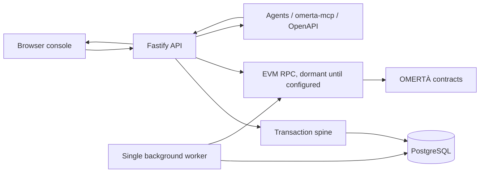

# Architecture

OMERTÀ is a server-authoritative multiplayer game with one off-chain source of truth, an optional
chain rail, several static human surfaces and a machine-player interface. The browser and MCP package
are clients; they choose actions and render results. They do not decide prices, odds, rewards or
state transitions.

## Runtime components

| Component | Primary artifacts | Responsibility |
|---|---|---|
| API process | `src/server.js`, `src/routes/`, `src/auth.js`, `src/ratelimit.js` | Serves the web surfaces and JSON API; authenticates, throttles and records routes; owns WebSocket presence and the in-process event bus. |
| Domain layer | `src/*.js`, `src/social/*.js` | Implements gameplay, economy, social state and reads of public/private boards. |
| Phase 1 world graph | `src/content/phase1.js`, `src/worldgraph*.js`, `src/items.js`, `src/crafting.js`, `src/mysteries.js`, `src/operations.js`, `src/routes/worldgraph.js` | Loads one canonical immutable package manifest; conserves stack and unique-item custody; executes direct-only mystery and Crew-operation graphs. |
| Transaction spine | `src/game.js`, `src/accrual.js` | Locks actors in a stable order, applies lazy accrual, persists state, writes ledger/audit records and fires post-commit notifications. |
| Database | `schema.sql`, `src/db.js` | PostgreSQL is production truth; `pg-mem` provides zero-infrastructure local tests and is explicitly not trusted for PostgreSQL-only behavior. |
| Worker | `src/worker.js`, `src/watcher.js` | Runs timed settlements, buybacks, season/world sweeps, monitoring and chain-event synchronization. Exactly one worker is intended. |
| Browser client | `public/index.html`, other `public/*.html`, `public/omerta-ui.css` | Static, no-build console plus admin, wiki, arena, play and public identity/share pages. |
| Agent interface | `AGENTS.md`, `omerta-mcp/`, `/openapi.json`, `/v1/rules`, `/v1/opportunities` | Gives agents stable machine-readable discovery, authentication and action surfaces. |
| Contracts | `omerta-contracts/src/` | Token, vouchers, gear/deeds/NFTs, fees, bonds, oracle, hook, staking, stock machine, bank protocol, settlement-gas pool and the dormant AcquisitionVault authority base. |
| Delivery plane | `.github/workflows/`, `render.yaml`, `tools/`, `test/` | CI, deployment declaration, performance/correctness harnesses, audits and release controls. |

## Request lifecycle

1. Fastify registers the route and derives the OpenAPI document from the live registry.
2. Public, authenticated and moderator routes pass through different guards. Mutating calls support
   idempotency keys; agent tokens have a stricter cadence.
3. Player actions generally enter `withCharacter` or `withTwoCharacters`. Two-party operations lock
   actors in a stable global order to prevent AB–BA deadlocks.
4. Lazy accrual is calculated from timestamps when state is touched. There is no global per-player
   tick.
5. The action changes server state and records value movement in the transaction ledger. Randomness
   is generated server-side and written to the RNG audit.
6. The transaction commits before non-critical notification/WebSocket hooks run.
7. The client receives facts and renders them. It must not restate a server lever it cannot know.

The [generated route catalog](generated/routes.md) maps each literal registration to its source,
access mode, domain and best-resolved handler module.

## Data architecture

`schema.sql` is both the fresh schema and a source of additive live migrations. `src/db.js` chooses
real PostgreSQL when `DATABASE_URL` exists and `pg-mem` otherwise. The production system depends on
PostgreSQL features and concurrency behavior that `pg-mem` cannot model, which is why `pgquery`,
`pgcheck`, `concurrency`, `loadtest` and `chaos` are separate gates.

The core consistency model is detailed in [data-economy.md](data-economy.md). The generated
[database catalog](generated/schema.md) gives every table and the modules that name it.

The Phase 1 graph is an intentionally separate runtime from the authored-content compiler. Run
`npm run worldgraph:check` for the canonical CORE + AUTOMOTIVE + BELLADONNA manifest and
`npm run content:check` for authored content packs; both are release gates.

## Process topology and scaling boundary

The declared Render topology is one API, one worker and one PostgreSQL database. The single API
instance is currently load-bearing because WebSocket presence, the event bus, fallback rate-limit
buckets and request metrics are process-local. Horizontal API scaling requires a shared rate limiter
and cross-process event fan-out first. The worker must also remain singleton unless each sweep gains a
distributed ownership/lease mechanism.

The database is the measured scaling dial in the current architecture. See `render.yaml` and
`DEPLOY.md` for the recorded load-test evidence and current production declaration.

## Chain boundary

The backend and contracts communicate through explicit parity surfaces: SIWE wallet linking,
on-chain fee events, persisted watcher cursors, EIP-712 withdrawal/gear vouchers and reserve
accounting. Shared finalized-observation code pins event consumers to an exact block/hash and
backfills after downtime. `StockTokenRegistryV2` and the standalone `SettlementGasPool` are reviewed
dormant foundations. `AcquisitionVault` currently contains only the independently approved O1
Safe/operator authority kernel; A1 accounting/ingress/budget and all later purchase, reconciliation
and outflow integration remain pending.

Production chain activation is deliberately dormant until configuration and external gates are
cleared. The game can operate off-chain without those variables. `CHAIN-DEPLOY.md` is the current
operational inventory authority. `CHAIN-AUDIT-PACKET.md` is a superseded 2026-08-21 pre-O1 snapshot;
it preserves historical attack-surface analysis but must be regenerated at the exact release head
before an external engagement.

## Architectural invariants

- The server is authoritative; clients send choices, never economic values.
- All real value movement is ledgered with a stable reason vocabulary.
- Actor locks follow one global order.
- Randomness is server-side and auditable.
- Accrual is lazy and timestamp-driven.
- Mutations are idempotent at the HTTP boundary.
- Generic Phase 1 owner/depositor tuples are immutable history, never estate assets: character death
  and replacement do not wipe, rewrite, inherit or duplicate them.
- Chain withdrawals are reserve-backed and voucher replay is rejected.
- Dormant integrations fail closed or disappear from the player surface.

