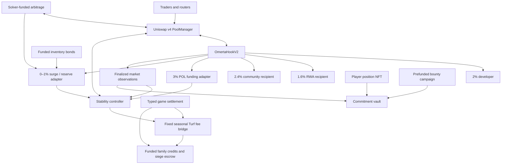

# OMERTÀ market

The canonical ETH/OMR market uses Uniswap v4 and companion contracts for stability, liquidity, funded bonds and family Turf. The implementation is available for release review; no live deployment, funded reserve, production signer, or game route is activated by these files.

The architecture places immediate settlement and measurements in the hook. Position custody, reserve policy, inventory bonds, family entitlements, player commitments, and solver execution have separate contracts. Those boundaries let each subsystem enforce its own conservation rules and recover independently.

## What is implemented

| Requested capability | Implementation | Exact meaning |
| --- | --- | --- |
| Current canonical tax | `OmertaHookV2` | 900 bps base: 200 developer, 160 RWA, 240 community, 300 POL. Rounding residual belongs to POL. |
| Surge response | Hook pressure accumulator | Additional 0–100 bps on sells, paid exclusively to stability. Tick pressure decays over time. Buys cannot instantly erase accumulated pressure. |
| Anti-snipe | Immutable opening policy | A bounded opening block window, bounded opening buy fee, and optional actual quote-size limit. The window cannot be extended by an administrator. |
| Market measurements | Hook epochs + `OmertaMarketStateV2` | Fixed-interval mean tick, tick dispersion, gross ETH turnover, volume imbalance, minimum active liquidity, and liquidity-time integration. |
| Olympus-inspired RBS | `OmertaStabilityControllerV2` | Separate downside/upside range inventory, finite capacity, cooldown, stress hysteresis, spaced X-of-Y recovery observations, funded partial regeneration. |
| POL | Controller Core | Actual PoolManager-owned two-sided positions and principal/fee separation. |
| Lower Cushion / Garrison | Controller compartments | ETH inventory placed above the reference raw tick to absorb OMR selling. |
| Upper Cushion / Desk | Controller compartments | OMR inventory placed below the reference raw tick to supply OMR into buying. |
| War Chest | Controller compartment | Idle funded inventory; no direct range deployment. Funds regeneration without resetting lifetime limits. |
| Large-buy bonds | `OmertaInventoryBondV2` | Existing OMR inventory sold for ETH with bounded discount, sale limits and linear vesting. No mint authority or sellback quote. |
| MEV/arbitrage participation | `OmertaArbitrageV2` and solver tooling | Solver-bound commit/reveal, atomic two-pool ETH/OMR cycle, minimum realized profit, fixed reserve share, caller collateral returned through claims. |
| Family Turf | `OmertaTurfV2` | Fixed seasonal price slabs; protocol principal stays in the controller; families receive funded LP fee credits. |
| Syndicates | Turf splits | Up to four families, exact 10,000-bps share total, prospective ownership. |
| Sieges | Turf + game adapter | Frozen defender/attacker treasury addresses, bounded duration and victory allocation, funded fee escrow, replay/revision checked resolution. |
| Corridors / loyalty / fortification | Bounded Turf status | Corridors require touching adjacent ranges with matching owners. Status is game data and never multiplies a monetary claim. |
| Historical fee ownership | Turf bridge + game adapter | LP collection and fee forwarding occur atomically before ownership, siege or treasury transitions. |
| Player liquidity commitments | `OmertaCommitmentVaultV2` | Actual canonical PositionManager NFT custody, finite lock term, two-epoch sampled useful-depth accounting, funded rewards, independent maturity exit. |
| Budgeted upkeep | `src/marketv2keeper.js` | Closed typed jobs, runtime pins, one-block reads, simulation, one new transaction per invocation, durable existing PostgreSQL transaction transport. |
| Deployment and rewiring | `tools/market-v2-deployment-plan.js` | Offline constructor/binding/initialization/funding transaction plan with deterministic address calculation. |

The contracts expose the market facts and bounded game settlement needed for the seasonal map and its presentation. Story authoring, combat adjudication, UI weather, broker-house interfaces, and off-chain family decisions remain server responsibilities. These contracts do not assert that those presentation or gameplay features have been installed in the production console. Leveraged family debt and transferable securitization of future family revenue are outside this implementation; the implemented bonds are funded inventory sales. DNR remains a separate denomination and system.

## Taxes and routing

The base sell fee is preserved in aggregate, with independent buckets for both ETH and OMR. Uniswap's exact-input/exact-output and return-delta rules determine the fee currency: the hook charges against actual settled deltas, including partial fills. Never assume every tax receipt is ETH. Opening buys may carry their separately configured temporary charge; buys outside that window have no hook buy tax. Uniswap LP fees are additional to hook taxes and are explicitly selected in the PoolKey.

Each bucket can be swept to its fixed recipient independently. A recipient may claim its own bucket to another destination. A failed recipient does not stop swaps or unrelated bucket claims. Recipient addresses, base rates, maximum surge, and opening policy are immutable.

These hook taxes apply to this canonical PoolKey. They do not impose a universal tax on OMR trades in other pools. In particular, an unhooked alternative v4 pool used by the solver has its own LP fee and no canonical hook tax. Market incentives and liquidity concentration determine where traders route; the hook cannot prohibit independent venues.

Route the 3% POL bucket to a Core `OmertaReserveFundingV2` instance. Route surge, inventory-bond proceeds and the arbitrage reserve share to a War Chest funding instance. Non-Turf LP fee recipients may also be that reserve instance. `flush()` forwards actual received ETH/OMR into the fixed compartment. It grants no new deployment capacity. The RWA, developer and community recipients remain explicit deployment inputs; existing downstream source-specific revenue policies remain separate.

OMR's transfer-tax `ammPairs(PoolManager)` must remain false for this canonical market. Registering the singleton PoolManager for transfer taxation would tax liquidity funding and settlements and could overlap the hook tax. Test and verify this before any deployment funding. Existing fees, withdrawals, RWA budgets, voucher rails and non-market token transfers are not redefined here.

## Price coordinates and finite inventory

The canonical order is native ETH as currency0 and 18-decimal OMR as currency1. Raw pool price is OMR per ETH. Increasing raw ticks means OMR is cheaper in ETH. Therefore an ETH-funded downside range lies **above** the raw reference tick; an OMR-funded upside range lies **below** it.

All active positions are reversible inventory. A fully converted ETH range can convert back if price returns before liquidity is removed. `finalize` performs the actual removal when a directional position has converted and the block condition is met. A graphical wall being crossed is not a settled inventory event.

Controller accounting separates idle ETH/OMR, deployed principal, returned principal, earned fees, current episode capacity, and lifetime deployment. The PoolManager's `callerDelta - feesAccrued` determines principal. Fees cannot be used as evidence of principal gain. Neither funding nor removing a position restores episode capacity.

Recovery uses unique epochs and a minimum time separation. After a complete Y-sample window contains X healthy samples, eligible recovery moves actual idle War Chest assets into the target compartment and replenishes only the bounded amount permitted by configuration. Lifetime deployment limits remain consumed. A recovery in market price never creates ETH reserves.

Core, Lower Cushion, Garrison, Upper Cushion, Desk and Turf each hold at most one active position per controller. Each controller's Turf range belongs to one immutable season and slab. Additional slabs use additional controller/bridge instances with their own budgets; they cannot silently share principal or fee authority. This topology favors explicit custody and budget separation over a single unbounded position array.

## Observations and adversarial limits

The hook integrates the previous tick/liquidity state over elapsed time before updating it from swap or liquidity callbacks. It publishes completed fixed epochs. Idle gaps are processed in bounded work and do not carry ancient volume into a fresh epoch. A same-block liquidity appearance does not manufacture an epoch of minimum depth. A genesis partial epoch does not qualify as a complete observation.

Market state consumes the completed interval outside swap settlement. It floors negative mean ticks correctly and computes a nonnegative tick-dispersion measure. Sell imbalance is attenuated by turnover relative to observed virtual ETH depth so a dust-only sell interval cannot report maximum stress. This is a bounded risk input; wash trading remains possible.

The oracle is historical pool information. It is not an external fair-value oracle. Minimum raw liquidity is a participation gate, not a proof of executable depth through the full range. Controller and bond execution additionally check actual spot deviation and actual current liquidity. Sustained manipulation, market losses and adverse selection remain economic risks constrained by finite inventory and limits.

Anti-snipe is per swap, not per human. A user can split trades or use several accounts. Commit/reveal binds a solver's plan to its address; it does not grant exclusive arbitrage, private order flow, or immunity to competing trades. On-chain minimum profit rejects a losing cycle; the solver can still pay gas for a failed transaction. Nothing in this version proves a market cannot surge or fall.

The hook uses a fixed LP fee policy. Its additional pressure charge is a hook fee. Supporting dynamically overridden LP fees would require a separately specified pool policy and fresh review; it is not silently conflated with the preserved tax.

## Family fees, game authority and seasons

Turf ownership is a right to future funded fees, with no right to remove LP principal. Family IDs map to treasury addresses and revisions. Every deposit resolves the then-authorized recipients, so already credited balances never migrate when a treasury changes.

Use `OmertaGameSettlementV2` as the registry's immutable game address. The adjudicator can submit typed ownership, siege and status outcomes with expected revisions, snapshot epochs and replay IDs. It cannot withdraw controller principal, choose arbitrary calldata, create fees, or replace the registry. The Safe creates seasons and ranges before they start. One bridge is bound to one lane; bindings and game-lane registration are completed before the season starts.

Before a takeover or siege begins, the adapter checkpoints that lane. Before a treasury wallet changes, it checkpoints every active lane, bounded to 64. This is intentional operational coupling: a failed source can delay a wallet change, while already credited claims and trading remain independent. Expired lanes can be closed and archived to free capacity for later seasons.

A siege freezes participant wallets and allocates only funded escrow. Expiry makes the default-defender outcome callable. The last accrued fee batch is credited to the frozen siege wallets before its snapshot is cleared. The economic cutoff is the **atomic on-chain checkpoint**, not a retrospectively inferred off-chain timestamp. Permissionless expiry must pass through the adapter. Season expiry removes the actual Turf position without consulting the oracle or pause state; fees earned until that transaction are still assigned to the recorded lane. Principal returns to that controller's Turf account for Safe retirement.

Off-chain receipts must identify chain, registry, season, turf, revision, epoch and a unique settlement ID. Registry replay protection is scoped to that lane. Public logs are chain evidence; an indexer must apply the chain's confirmation and reorg policy before displaying a game settlement as final. These logs do not authorize the ordinary game cash ledger to pay anything.

## Player commitments and bonds

The commitment vault accepts only actual PositionManager NFTs for the canonical pool. Custody prevents the original owner from removing liquidity during the agreed term. A subscribed, empty, foreign-pool or previously committed NFT is rejected. Maturity withdrawal is available to the depositor without querying the market oracle or requiring rewards to be claimable.

Rewards require two distinct, fresh, qualifying observations. Useful depth is conservatively sampled on both sides of a bounded reference band; the smaller adjacent sample bounds credited depth-time. Invalid samples, gaps or pause transitions break accrual. This does not prove continuous range occupancy. Each campaign is prefunded and has fixed terms and limits. Rewards are first-come against available campaign funds at checkpoint time. NFT splitting and keeper timing are economic limitations to calibrate, not hidden guarantees of fairness.

Inventory bonds accept ETH only when sufficient OMR is already funded. A purchase reserves its complete future entitlement immediately, with per-purchase, per-epoch and lifetime limits in both assets and an absolute rate bound. Nontransferable notes vest linearly. Pausing purchases, exhausting inventory or losing the oracle does not block a vested claim. The contract cannot mint tokens or buy them back from note holders. Selling vested OMR through the canonical pool still incurs the canonical sell fee.

## Operational scope

The keeper is a bounded command, suitable for an explicitly configured external scheduler. It does not schedule itself or run indefinitely. Its plan mode needs no signing key and performs read-only RPC simulation. Run mode uses the existing shared PostgreSQL nonce/transaction journal: signed bytes are retained before broadcast, ambiguous transactions reconcile before any new transaction, and daily gas is bounded. Market capital and fees are accounted on chain; this transport does not book them into the game cash or separate POL ledger.

The solver compares approved unhooked alternative pools, checks quotes including canonical taxes and all LP fees, requires a configured gas allowance plus minimum solver profit after reserve sharing, and persists an exact plan before commitment. Reveal must use that same plan within the on-chain window. A quote is an estimate at a pinned block; execution still revalidates actual realized profit.

Deployment parameters, real reserves, initial price, initial liquidity, recipient custody, epoch length, range width, campaign economics and solver profitability are not inferred from branding or invented by the implementation. The example manifest is a local-chain test fixture. Before a funded release, measure those parameters on the intended chain, reproduce the plan on a fork, and retain the exact runtime/configuration checks. See `RUNBOOK.md` and the scoped review package.

## Primary references

- [Uniswap v4 hooks](https://developers.uniswap.org/docs/protocols/v4/concepts/hooks): pool hooks and their callback permissions.
- [Uniswap v4 dynamic fees](https://developers.uniswap.org/docs/protocols/v4/concepts/dynamic-fees): LP fee policies are distinct from this hook's tax accounting.
- [Olympus range-bound stability](https://docs.olympusdao.finance/main/overview/range-bound): inspiration for finite capacity and regeneration. Its documentation currently describes RBS as disabled and replaced by YRF plus the Emissions Manager; this implementation does not claim to deploy Olympus's current system.
- [Uniswap range orders](https://developers.uniswap.org/docs/sdks/v3/guides/managing-liquidity/range-orders): concentrated inventory can reverse until liquidity is removed.

The source and test evidence in this repository determine this implementation's behavior. The references explain underlying mechanisms and do not constitute security clearance for OMERTÀ.
